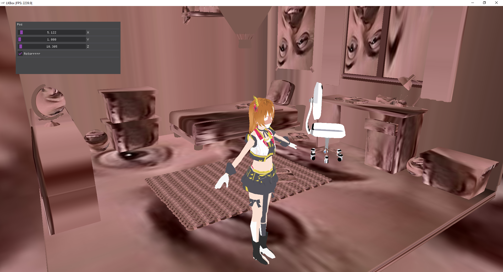

##   
**LKBox**

**A Work-In-Progress**. **LKBox** - cross-platform game engine based on C++ and GLFW 

## Screenshot

## Getting started
### Building ReadMe
[Building](docs/README.MD)

### Game template
A game template repository can be found here:

**WIP**

## State
A Work-In-Progress.

## Used libraries
* [LKBox](https://github.com/lakomoor/lkbox)
  * [GLFW]()
  * [GLAD]()
  * [GLM]()
  * [IMGUI]()
  * [Assimp]()

**NO USED**
* [Bullet]()
* [LuaBridge]()
* [OpenAL]()
* [STB]()
* [zlib]()
* [TinyXML]()

## License

`LKBox` source code is licensed under the terms of the [MIT License](https://github.com/LakoMoor/LKBox/blob/master/LICENSE)
